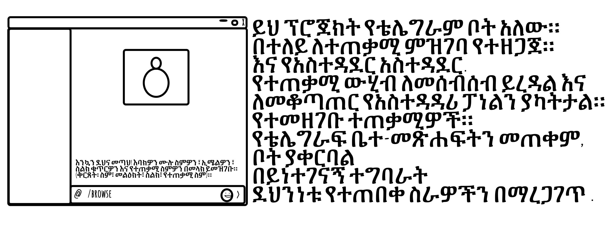

# Telegram Bot Project

_Read this in other languages:_  
[_አማርኛ_](README.am-AM.md) [_English_](README.md)

## አጠቃላይ እይታ።

ይህ ፕሮጀክት ለተጠቃሚ ምዝገባ እና ለአስተዳዳሪ አስተዳደር የተነደፈ የቴሌግራም ቦትን ተግባራዊ ያደርጋል። ቦት የተጠቃሚ ውሂብ መሰብሰብን ያመቻቻል እና የተመዘገቡ ተጠቃሚዎችን ለማስተዳደር የአስተዳዳሪ ፓነል ያቀርባል። የቴሌግራፍ ቤተ-መጽሐፍትን በመጠቀም በይነተገናኝ ባህሪያትን ያቀርባል እና ደህንነቱ የተጠበቀ ስራዎችን ያረጋግጣል።



## ቅድመ-ሁኔታዎች

### Node.js
- በኮምፒተርዎ ላይ Node.js መጫኑን ያረጋግጡ።

### Database
- የተጠቃሚ ፋይል ለማከማቸት MySQL ዳታቤዝ ያስፈልጋል።

### Environment Variables
- ሚስጥራዊ ፋይል ለመቆጣጠር የ`.env`  ይጠቀሙ እንደ ዳታቤዝ ምስክርነቶች እና ቴሌግራም ቦት ቶከን።

### መጫን

#### ስለዚህ የሚከተሉትን የመጫኛ ትዕዛዞችን ያሂዱ

### ማከማቻውን ይዝጉ።

```bash
git clone "https://github.com/ElrohiFilmon/crossroads.git"
cd telegram-bot
```
ወይም ይዘቱን ወደ ውስጥ ለማስገባት ዚፕ ፋይሉን ያግኙ እና አድርጉት። 

### የመጫኑ የጀርባ አጥንቶች።

ከሚከተለው ይዘት ጋር ባለ `package.json`ፋይል ፍጠር፡-
```json
{
    "name": "telegram-bot",
    "version": "0.0.1",
    "description": "ለተጠቃሚ ምዝገባ እና ለአስተዳዳሪ አስተዳደር የቴሌግራም ቦት።",
    "main": "bot.js",
    "scripts": {
      "start": "node bot.js"
    },
    "dependencies": {
      "dotenv": "^10.0.0",
      "telegraf": "^4.0.0",
      "sequelize": "^6.0.0",
      "mysql2": "^2.0.0"
    },
    "author": "Elrohi Filmon",
    "license": "MIT"
}
```

ከዚያም የሚፈለጉትን ፓኬጆች ይጫኑ:

```bash
npm install
```

### የ.env ፋይልን ያዘጋጁ።

በፕሮጀክቱ ስር `የenv` ፋይል ይፍጠሩ እና የሚከተሉትን መስመሮች ይጨምሩ፡-

```plaintext
DB_NAME=your_database_name
DB_USER=your_database_user
DB_PASSWORD=your_database_password
DB_HOST=localhost
TELEGRAM_BOT_TOKEN=your_telegram_bot_token
```

## ቦት መጠቀም።

### Start the Application

የሚከተለውን ትዕዛዝ በመጠቀም ቦቱን ተጠቀሙ፡-

```bash
npm start
```

# # ኮድ መዋቅር

1. *** ቦት ማስጀመሪያ**።
   - የቴሌግራፍ ቦትን ከቀረበው ማስመሰያ ጋር ያስጀምራል።
   - ለክፍለ-ጊዜ አስተዳደር መካከለኛ ዌርን ያዋቅራል።

2. ** የተጠቃሚ ትዕዛዞች ***
   - **/start**: የተጠቃሚ ምዝገባን ይጀምራል።
   - **/browse**: ተጠቃሚዎች መገለጫቸውን እና ያሉትን ትዕዛዞች እንዲመለከቱ ያስችላቸዋል።

3. **የአስተዳዳሪ ትዕዛዞች**
   - **/admin**: ተጠቃሚው አስተዳዳሪ ከሆነ የአስተዳዳሪ ትዕዛዞችን ያሳያል።
   - **/viewusers**: ሁሉንም የተመዘገቡ ተጠቃሚዎችን ይዘረዝራል።
   - **/promote**: ተጠቃሚን ለአስተዳዳሪ ይሾማል።
   - **/demote**: ተጠቃሚን ከአስተዳዳሪ ይሽራል።

4. **የውሂብ አስተዳደር**
   - ለዳታቤዝ መስተጋብር Sequelizeን ይጠቀማል።
   - ደህንነቱ የተጠበቀ የምዝገባ እና የአስተዳዳሪ አስተዳደር ተግባራትን ተግባራዊ ያደርጋል።

## Limitations and Possible Improvements

1. **User Interface**: ለተሻለ የተጠቃሚ ተሞክሮ የአሁኑ በይነገጽ ሊሻሻል ይችላል።
2. **Error Handling**: የበለጠ አጠቃላይ የስህተት አያያዝ ሊተገበር ይችላል።

## ተደጋጋሚ ጥያቄዎች

**Q**: ቦቱን ለብዙ ተጠቃሚዎች በአንድ ጊዜ መጠቀም እችላለሁ?  
**A**: አዎ፣ ቦት ብዙ ተጠቃሚዎችን ለማስተናገድ የተነደፈ ነው።

**Q**: የአስተዳዳሪ የይለፍ ቃሌን ከረሳሁ ምን ይሆናል?  
**A**: የአስተዳዳሪ ማረጋገጫ በመረጃ ቋት ግቤቶች ላይ የተመሰረተ ነው; ምስክርነቶችዎን ደህንነቱ የተጠበቀ መሆኑን ያረጋግጡ።

## የወደፊት ማሻሻያዎች።

- የበለጠ የላቀ የተጠቃሚ በይነገጽን ይተግብሩ።
- ለተጠቃሚ አስተዳደር ተጨማሪ ባህሪያትን ያክሉ።
- የስህተት መልዕክቶችን እና አያያዝን ያሻሽሉ።

## ማጣቀሻዎች

- [Telegraf Documentation](https://telegraf.js.org/)

- [GitHub](https://github.com/sequelize/sequelize/)
- [Stack Overflow - New Bot News](https://stackoverflow.com/questions/tagged/bots)
- [YouTube - Telegraf Tutorial](https://www.youtube.com/watch?v=WW4NZySuL5Y&list=PLjEYzWkdEvxvJ8lZacERw_NiUKbB7l_dx)
#

