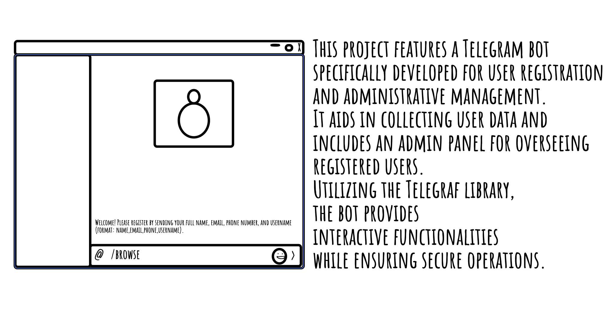

# Telegram Bot Project

_Read this in other languages:_  
[_አማርኛ_](README.am-AM.md) [_English_](README.md)

## Overview

This project implements a Telegram bot designed for user registration and admin management. The bot facilitates user data collection and provides an admin panel for managing registered users. Leveraging the Telegraf library, it offers interactive features and ensures secure operations.



## Prerequisites

### Node.js
- Ensure you have Node.js installed on your system.

### Database
- A MySQL database is required to store user data.

### Environment Variables
- Use a `.env` file to manage sensitive information such as your database credentials and Telegram bot token.

## Installation

### Clone the Repository

First, clone the application from GitHub:

```bash
git clone "https://github.com/ElrohiFilmon/telegramadminbotdp.git"
cd telegram-bot
```
Or get the zip file and unzip to get the contents inside 

### Install Dependencies

Create a `package.json` file with the following content:

```json
{
    "name": "telegram-bot",
    "version": "0.0.1",
    "description": "A Telegram bot for user registration and admin management.",
    "main": "bot.js",
    "scripts": {
      "start": "node bot.js"
    },
    "dependencies": {
      "dotenv": "^10.0.0",
      "telegraf": "^4.0.0",
      "sequelize": "^6.0.0",
      "mysql2": "^2.0.0"
    },
    "author": "Elrohi Filmon",
    "license": "MIT"
}
```

Then, install the required packages:

```bash
npm install
```

### Set Up the .env File

Create a `.env` file in the project root and add the following lines:

```plaintext
DB_NAME=your_database_name
DB_USER=your_database_user
DB_PASSWORD=your_database_password
DB_HOST=localhost
TELEGRAM_BOT_TOKEN=your_telegram_bot_token
```

## Running the Bot

### Start the Application

Run the bot using the following command:

```bash
npm start
```

## Code Structure

1. **Bot Initialization**
   - Initializes the Telegraf bot with the provided token.
   - Configures middleware for session management.

2. **User Commands**
   - **/start**: Initiates user registration.
   - **/browse**: Allows users to view their profile and available commands.

3. **Admin Commands**
   - **/admin**: Displays admin commands if the user is an admin.
   - **/viewusers**: Lists all registered users.
   - **/promote**: Promotes a user to admin.
   - **/demote**: Demotes a user from admin.

4. **Data Management**
   - Utilizes Sequelize for database interactions.
   - Implements secure registration and admin management functionalities.

## Limitations and Possible Improvements

1. **User Interface**: The current interface can be improved for better user experience.
2. **Error Handling**: More comprehensive error handling can be implemented.

## FAQs

**Q**: Can I use the bot for multiple users simultaneously?  
**A**: Yes, the bot is designed to handle multiple users.

**Q**: What happens if I forget my admin password?  
**A**: Admin authentication is based on database entries; ensure to keep your credentials secure.

## Future Enhancements

- Implement a more advanced user interface.
- Add additional features for user management.
- Improve error messages and handling.

## References

- [Telegraf Documentation](https://telegraf.js.org/)
- [GitHub](https://github.com/)
- [Stack Overflow - Telegram Bot Development](https://stackoverflow.com/)
- [YouTube - Telegraf Tutorial](https://www.youtube.com/)
#

